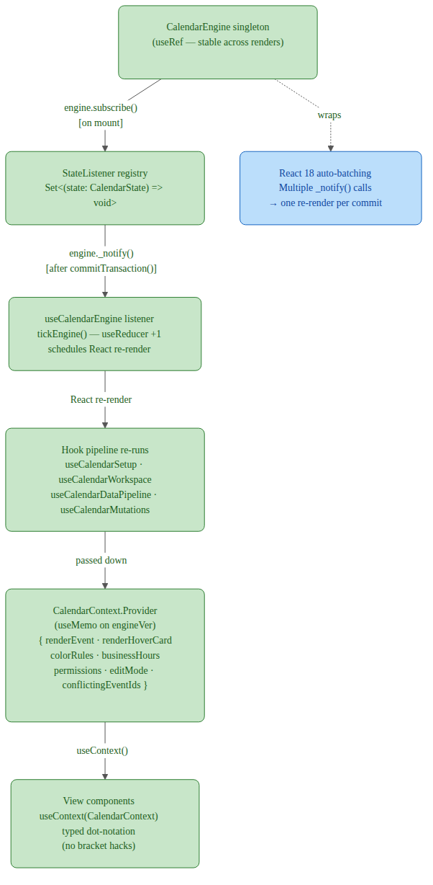
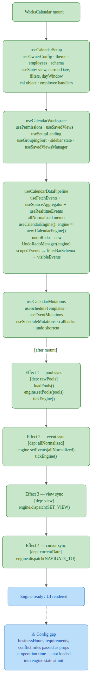

# Works Calendar — Data Flow Diagrams

Three levels of DFD covering the full library. Context (Level 0) → subsystems
(Level 1) → internals of the four most complex subsystems (Level 2).

> **Architecture status**: Diagrams below reflect the **target architecture**
> after the three-sprint refactor (see CHANGELOG `[0.7.0]`). The key
> structural changes from the audit:
> - `CalendarEngine` is now the **sole** source of truth for view, cursor, and
>   base filter state. The legacy `useCalendar` hook and its parallel state are gone.
> - `useCalendarEngine` owns engine setup, undo/redo, and all mutation handlers —
>   `WorksCalendar.tsx` is now a pure UI shell.
> - `useOccurrences` deleted; all views use the engine's `getOccurrencesInRange`
>   read path exclusively.
> - `CalendarContextValue` is fully typed — no more `[key: string]: any` escape hatch.

---

## Level 0 — Context Diagram

The library as a single process interacting with the world.

**External entities**

| Entity | Data In | Data Out |
|---|---|---|
| Host App | `events[]`, `config`, adapter, filter schema, slot renderers | `visibleEvents[]`, callbacks (onClick, onSave, onDelete, onModeChange) |
| Remote Data Source | Adapter pull results (loadRange) or push (subscribe) | CRUD operations from SyncManager |
| Browser Storage | — | Persisted config, pools, profile, saved views |
| External Channels | — | Booking lifecycle notifications (approve, deny, cancel) |

---

## Level 1 — Subsystem Diagram

Seven major subsystems inside the library and the data flows between them.

### Subsystem summary

| # | Subsystem | Key inputs | Key outputs |
|---|---|---|---|
| 1 | Adapter Layer | Remote events, config | `CalendarEventV1[]`, `AdapterChange` stream |
| 2 | Calendar Engine | `EngineOperation`, config | `CalendarState`, `OperationResult`, lifecycle emits |
| 3 | Occurrence Expansion | `EngineEvent[]`, date range | `EngineOccurrence[]` (rrule-expanded) |
| 4 | Filter & Grouping | Occurrences, filter state, schema | `visibleEvents[]`, grouped rows |
| 5 | View Layer | `visibleEvents[]`, cursor, view type | Rendered calendar; user event callbacks |
| 6 | Workflow & Approvals | Transition actions, workflow DSL | Updated `ApprovalStage`, audit trail, channel emits |
| 7 | Config & Persistence | `config.json`, localStorage | Parsed config, themes, pools, profile |

---

## Level 2 — Subsystem Internals

Detailed flows for all major subsystems: engine (2a), occurrence/filter (2b), adapter/sync (2c), workflow/approvals (2d), view layer (2e), config/persistence (2f), conflict engine (2g), requirements engine (2h), geo conflicts (2i), pool query DSL (2j).

---

### 2a — Calendar Engine + Orchestration Hook (Subsystems 1 + 2, post-Sprint-2/3)

---

### 2b — Occurrence Expansion & Filtering (Subsystems 3 + 4)

---

### 2c — Adapter Layer & Sync (Subsystem 1)

---

### 2d — Workflow & Approval System (Subsystem 6)

---

### 2e — View Layer (Subsystem 5)

---

### 2f — Config & Persistence (Subsystem 7)

---

### 2g — Conflict Engine

---

### 2h — Requirements Engine

---

### 2i — Geo Conflict Engine

---

### 2j — Pool Query DSL

---

## Level 3 — Process Internals

Detailed decomposition of the highest-complexity processes within Level 2 subsystems: validation pipeline (3a), React subscription chain (3b), MonthView layout (3c), WeekView/DayView time grid (3d), initialization sequence (3e), undo/redo (3f), SyncQueue retry/conflict (3g).

---

### 3a — Engine Validation Pipeline (full decomposition of 2a validateConstraints)

---

### 3b — React Hook Subscription Chain

---

### 3c — MonthView Layout Algorithm

---

### 3d — WeekView / DayView Time Grid

---

### 3e — Config / Engine Initialization Sequence

---

### 3f — Undo / Redo Snapshot Mechanism

---

### 3g — SyncQueue: Optimistic Update, Retry, and Conflict Resolution

---

## Sprint Implementation Status

All six audit issues resolved across three sprints. See `CHANGELOG [0.7.0]` for details.

| # | Issue | Sprint | Status |
|---|-------|--------|--------|
| 1 | Duplicate recurrence expansion (`useOccurrences` deleted; engine read path only) | 3 | ✅ Done |
| 2 | `CalendarContext` typed as `any` → fully typed `CalendarContextValue` | 1 | ✅ Done |
| 3 | Dual state systems (`useCalendar` removed; engine is sole source of truth) | 3 | ✅ Done |
| 4 | Thin export wrapper (`exportToExcelLazy.ts` deleted; `excelExport.ts` exported directly) | 3 | ✅ Done |
| 5 | O(n) dependency lookups → `_dependenciesByFromEvent` / `_dependenciesByToEvent` indexes added | 1 | ✅ Done |
| 6 | `WorksCalendar.tsx` orchestration burden → extracted into `useCalendarEngine` hook | 2 | ✅ Done |
