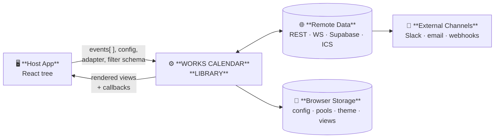
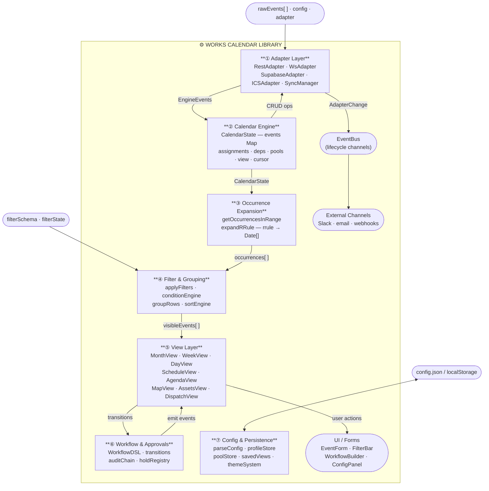

# Works Calendar — Data Flow Diagrams

Three levels of DFD covering the full library: Context (Level 0) → Subsystems (Level 1) → Internals of the four most complex subsystems (Level 2).

> **Architecture status — post-Sprint-3 (all sprints complete)**
> - `CalendarEngine` is the **sole** source of truth for view, cursor, and base filter state — `useCalendar` hook removed.
> - `useCalendarEngine` owns engine setup, undo/redo, and all mutation handlers — `WorksCalendar.tsx` is a pure UI shell.
> - `useOccurrences` deleted; all views read through the engine's `getOccurrencesInRange` path.
> - `CalendarContextValue` is fully typed — no `[key: string]: any` escape hatch.

---

## Level 0 — Context Diagram

The library as a single process interacting with the outside world.



| Entity | Data In | Data Out |
|--------|---------|----------|
| Host App | `events[]`, config, adapter, filter schema, slot renderers | `visibleEvents[]`, callbacks (onClick, onSave, onDelete) |
| Remote Data Source | Adapter pull results (`loadRange`) or push (`subscribe`) | CRUD operations from SyncManager |
| Browser Storage | — | Persisted config, pools, profile, saved views |
| External Channels | — | Booking lifecycle notifications (approve, deny, cancel) |

---

## Level 1 — Subsystem Diagram

Seven major subsystems and the data flows between them.



| # | Subsystem | Key Inputs | Key Outputs |
|---|-----------|------------|-------------|
| ① | Adapter Layer | Remote events, config | `CalendarEventV1[]`, `AdapterChange` stream |
| ② | Calendar Engine | `EngineOperation`, config | `CalendarState`, `OperationResult`, lifecycle emits |
| ③ | Occurrence Expansion | `EngineEvent[]`, date range | `EngineOccurrence[]` (rrule-expanded) |
| ④ | Filter & Grouping | Occurrences, filter state, schema | `visibleEvents[]`, grouped rows |
| ⑤ | View Layer | `visibleEvents[]`, cursor, view type | Rendered calendar; user event callbacks |
| ⑥ | Workflow & Approvals | Transition actions, workflow DSL | Updated `ApprovalStage`, audit trail, channel emits |
| ⑦ | Config & Persistence | `config.json`, localStorage | Parsed config, themes, pools, profile |

---

## Level 2 — Subsystem Internals

Detailed flows for the four highest-complexity subsystems.

---

### 2a — Calendar Engine + Orchestration (Subsystems ① + ②)

```
  EngineOperation
  (type · eventId · newStart/End · resource · meta)
  ──────────────────────────────────────────────────►┐
                                                     │
  ┌──────────────────────────────────────────────────▼──────────────────┐
  │                       CALENDAR ENGINE                               │
  │                                                                     │
  │  resolvePoolOnSubmit()                                              │
  │    op.resourcePoolId set?                                           │
  │      → scan pool members, pick next via strategy                   │
  │      → rewrite op with concrete resourceId + poolUpdate            │
  │                              │                                      │
  │                              ▼                                      │
  │  validateOperation()  ──────────────────────► validateConstraints() │
  │    ├─ validateEvent()                          (hard: reject)       │
  │    ├─ validateOverlap()                        (hard)               │
  │    ├─ validateDependencies()                   (hard)               │
  │    ├─ validateWorkingHours()                   (soft: warn)         │
  │    └─ validateEventConstraints()               (configurable)       │
  │                              │                                      │
  │             hard violation? ─┤                                      │
  │                YES ──────────┴──► OperationResult { rejected }      │
  │                NO                 │                                 │
  │             soft violation (no override)? ──► OperationResult       │
  │                                                { pending-confirm }  │
  │                              │                                      │
  │                              ▼                                      │
  │  resolveOperationScope()                                            │
  │    this-only / this+future / all-in-series                         │
  │                              │                                      │
  │                              ▼                                      │
  │  buildOperation() + applyOperation()                                │
  │    → EventChange[] { created | updated | deleted }                  │
  │                              │                                      │
  │                              ▼                                      │
  │  beginTransaction() / commitTransaction()                           │
  │    new Map<id, EngineEvent>  (immutable swap)                       │
  │    atomic pool cursor advance                                       │
  │                              │                                      │
  │                              ▼                                      │
  │  _emitBookingLifecycle()                                            │
  │    EventBus.emit(booking.requested | approved | denied | cancelled) │
  │                              │                                      │
  │                              ▼                                      │
  │  _notify() → all StateListeners                                     │
  └──────────────────────────────┬──────────────────────────────────────┘
                                 │
             ┌───────────────────┼──────────────────────┐
             ▼                   ▼                      ▼
     OperationResult       CalendarState          EventBus payload
     { status,             (new events Map,       → channel adapters
       violations,          pools, cursor)          (Slack · email
       changes }                                     · webhooks)

  UndoRedoManager wraps the engine:
    snapshot()       before each mutation  → TransactionHandle
    rollbackTo(h)    on Ctrl+Z            → restore events + pools
    re-apply stack   on Ctrl+Y
```

---

### 2b — Occurrence Expansion & Filtering (Subsystems ③ + ④)

```
  CalendarState.events          cursor / view type
  Map<id, EngineEvent>          month | week | day | schedule …
         │                               │
         └─────────────┬─────────────────┘
                       ▼
       getOccurrencesInRange(rangeStart, rangeEnd)
         │
         ├─ Non-recurring event  → pass through if overlaps range
         └─ Has rrule            → expandRRule(start, rrule, exdates, range±7d)
                                     → Date[] → EngineOccurrence[]
                                     max 500 occurrences per series (guard)
         ▼
  EngineOccurrence[]   { id · seriesId · start · end · title · resource · … }
         │
         ▼
  ┌──────────────────────────────────────────────────────────┐
  │                    FILTER PIPELINE                       │
  │                                                          │
  │  applyFilters(occurrences, filterState, schema)          │
  │                                                          │
  │  text / search   → title + category + resource match     │
  │  date-range      → isWithinInterval check                │
  │  multi-select    → Set membership (categories, resources)│
  │  custom field    → field.predicate(item, value)          │
  │                                                          │
  │  conditionEngine (AdvancedFilterBuilder):                │
  │    evaluates AND/OR trees against event meta             │
  │    operators: eq · gt · contains · …                     │
  └──────────────────────────┬───────────────────────────────┘
                             │ filtered events[]
                             ▼
  ┌──────────────────────────────────────────────────────────┐
  │               GROUPING + SORT PIPELINE                   │
  │                                                          │
  │  sortEvents(events, sortConfig)                          │
  │    → stable sort by field asc / desc                     │
  │                                                          │
  │  groupRows(events, groupByConfig)                        │
  │    buildFieldAccessor(field) → value extractor           │
  │    group by 1–3 levels (category · resource · date …)   │
  │    → GroupRow[] with children + header labels            │
  └──────────────────────────┬───────────────────────────────┘
                             │
                             ▼
               grouped / sorted visibleEvents[]
               → active View component
```

---

### 2c — Adapter Layer & Sync (Subsystem ①)

```
  CalendarAdapter (interface)
  ┌────────────────────────────────────────────────────────────────────┐
  │  ┌─────────────┐  ┌─────────────┐  ┌──────────────┐  ┌─────────┐ │
  │  │ RestAdapter │  │  WsAdapter  │  │  Supabase    │  │  ICS   │ │
  │  │ loadRange() │  │ subscribe() │  │  Adapter     │  │ Adapter │ │
  │  │ createEvent │  │ (WebSocket) │  │  (realtime   │  │ parseICS│ │
  │  │ updateEvent │  │             │  │   channel)   │  │         │ │
  │  │ deleteEvent │  │             │  │              │  │         │ │
  │  └─────────────┘  └─────────────┘  └──────────────┘  └─────────┘ │
  └────────────────────────────┬───────────────────────────────────────┘
                               │ CalendarEventV1[]
                               ▼
  ┌────────────────────────────────────────────────────────────────────┐
  │                         SYNC MANAGER                              │
  │                                                                   │
  │  loadRange(start, end)                                            │
  │    → adapter.loadRange() → merge into events Map                 │
  │                                                                   │
  │  createEvent / updateEvent / deleteEvent                          │
  │    1. Apply optimistically to local events Map                    │
  │    2. Enqueue to SyncQueue  (status: 'pending')                   │
  │    3. Notify subscribers                                          │
  │    4. Call adapter in background                                  │
  │       ✓ success  → mark 'synced', replace with server copy       │
  │       ✗ conflict → conflictResolver(local, server)               │
  │                      'server-wins' | 'client-wins' | 'latest-wins'│
  │                      'manual'      → onConflict callback (UI)     │
  │       ✗ error    → mark 'error', call onError, keep rollback     │
  │                      retry up to maxRetries with exp. backoff     │
  │                                                                   │
  │  connectLive()                                                    │
  │    → adapter.subscribe(AdapterChangeCallback)                     │
  │    → insert / update / delete patched into local Map             │
  │    → reload replaces full Map                                     │
  └────────────────────────────┬───────────────────────────────────────┘
                               │ SyncState
                               │ { events: Map · syncStatuses: Map
                               │   isSyncing · conflicts }
                               ▼
                     useSyncedCalendar hook
                     (React wrapper around SyncManager)
```

---

### 2d — Workflow & Approval System (Subsystem ⑥)

```
  User action          Workflow DSL        ApprovalStage
  approve / deny /     (Workflow JSON)     (from event.meta)
  cancel / timeout
        │                    │                   │
        └────────────────────┼───────────────────┘
                             ▼
  ┌───────────────────────────────────────────────────────────────┐
  │                    transitionApproval()                       │
  │                                                               │
  │  1. legalActionsFrom(currentStage)                            │
  │       guard illegal jumps (finalized → requested is blocked)  │
  │                                                               │
  │  2. If workflow supplied:                                     │
  │       advance(workflowInstance, action)                       │
  │         → auto-walk condition + notify nodes                  │
  │         → stop at approval node       → awaiting              │
  │         → stop at terminal node       → completed | denied    │
  │         → parallel branches: per-branch approval tracking     │
  │              join on quorum (requireAll / requireAny /        │
  │                              requireCount)                    │
  │         → WorkflowInstance (updated)                          │
  │         → WorkflowEmitEvent[]                                 │
  │              node_entered · action_taken · outcome_set        │
  │              timer_scheduled                                  │
  │                                                               │
  │  3. appendAuditEntry(stage, action, actor, reason)            │
  │       SHA-256 hash chain (tamper-evident audit trail)         │
  │                                                               │
  │  4. Return TransitionResult { ok · stage · workflowInstance } │
  └───────────────────────┬───────────────────────────────────────┘
                          │
          ┌───────────────┼─────────────────┐
          ▼               ▼                 ▼
  Updated             WorkflowInstance  WorkflowEmitEvent[]
  ApprovalStage       (host persists    → EventBus channels
  (host writes         to event.meta)      booking.approved
   back to event)                          booking.denied
                                           booking.cancelled
                                        → channel adapters
                                           Slack · email · webhooks

  useWorkflowTicker (React hook):
    setInterval → tick(instance, workflow, now)
      → fires 'timeout' when node deadline passed
      → calls onTimeout callback for host to persist result

  HoldRegistry (booking holds):
    acquireHold(resourceId, window, holderId, ttl)
      → blocks overlapping booking attempts with soft violation
    releaseHold(holdId)    → on form close / submit
    findBlockingHold()     → used by conflictEngine
```

---

## Sprint Status

| # | Issue | Sprint | Status |
|---|-------|--------|--------|
| 1 | Duplicate recurrence expansion (`useOccurrences` vs engine path) | 3 | ✅ Done |
| 2 | `CalendarContext` typed as `any` | 1 | ✅ Done |
| 3 | Dual state systems (`useCalendar` + `CalendarEngine`) | 3 | ✅ Done |
| 4 | Thin export lazy wrapper (`exportToExcelLazy.ts`) | 3 | ✅ Done |
| 5 | O(n) dependency lookups in engine | 1 | ✅ Done |
| 6 | `WorksCalendar.tsx` 80+ import orchestration burden | 2 | ✅ Done |
